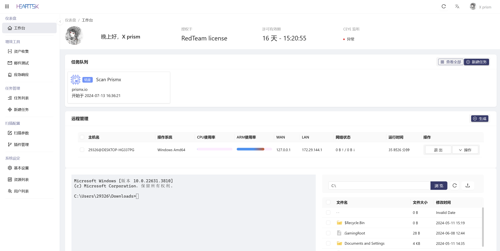
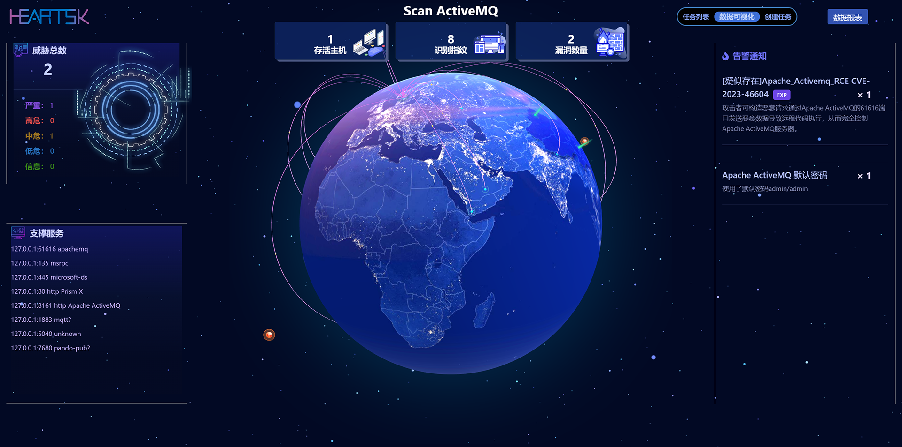
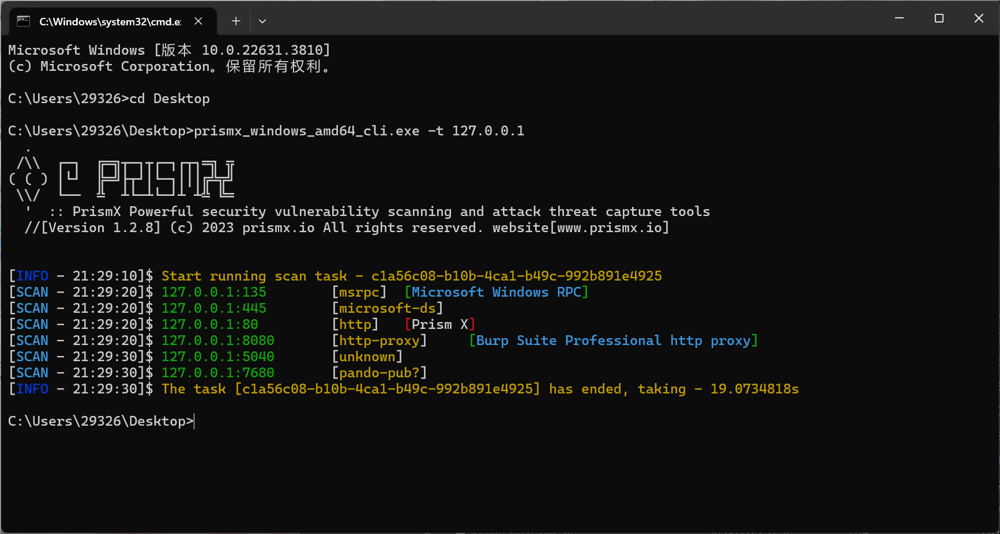

<h1 align="center">

<a href="https://prismx.io/"></a>

</h1>

<h1 align="center">::Prism X·Lightweight cross-platform individual soldier penetration system</h1>

---

<p align="center">
  <a href="https://prismx.io/guide" target="_blank">Use documentation</a> ·
  <a href="https://prismx.io/guide">Remote management</a> ·
  <a href="https://prismx.io/guide">risk scan</a> ·
  <a href="https://prismx.io/guide">Email test</a> ·
  <a href="https://prismx.io/guide">一key emergency</a>
</p>

## start up

### · WEB system

##### Dependency files：

- lib.zip： web version dependent library，CLI 
No need to download the mode。


storage warehouse： https://oss.prismx.io Linux Amd64 Run the example：

```bash
$ wget https://oss.prismx.io/lib.zip
$ wget https://oss.prismx.io/prismx_linux_amd64
$ unzip lib.zip
$ chmod +x prismx_linux_amd64
$ ./prismx_linux_amd64
```

Access after startup`https://yourIP:443`You can enter the login page and use -port Parameters can specify ports。System default account`prismx/prismx@passw0rd`
，Please change your account name and password when using it for the first time.！

#### Home page：



#### Big data screen：



### · CLI command line

The command line mode does not require any dependency files and only has the basic scanning module. Execute the -h command to get related help.

```bash
$ ./prismx_linux_amd64_cli -h
$ ./prismx_linux_amd64_cli -t 127.0.0.1 -p 1-500,3000-6000
```



---

## QQ Security Research Group：

### [Click to join：528118163](https://jq.qq.com/?_wv=1027&k=azWZhmSy)

##Join the group/contact (left) | Public account: Zhetian Laboratory (right)


