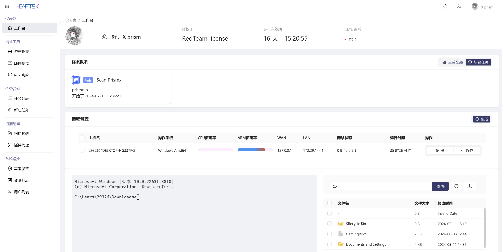
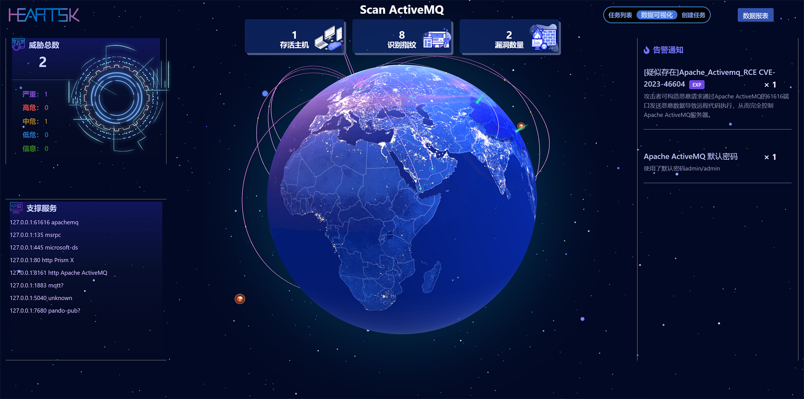

# ::Prism X· 一Integrated lightweight cross-platform penetration system 

---

<p align="center">
  <a href="https://prismx.io/guide" target="_blank"Use documentation</a> ·
  <a href="">Host management</a> ·
  <a href="">risk scan</a> ·
  <a href="">exploit</a> 
</p>

## start up

### · WEB system

Download the software package corresponding to OS ARCH [Prism X releases](https://github.com/yqcs/prismx/releases/)
, just run it directly after decompressing it and granting executable permissions



Linux Amd64 Run the example：

```bash
$ wget https://github.com/yqcs/prismx/releases/download/{version}/prismx.zip
$ unzip prismx_linux_amd64.zip
$ cd prismx_linux_amd64
$ chmod +x prismx
$ ./prismx
```

#### System default account：`prismx/prismx@passw0rd`

### · Interface preview



---

## QQ Security Research Group：

### [Click to join：528118163](https://jq.qq.com/?_wv=1027&k=azWZhmSy)

## Join the group/contact (left) | Public account: Zhetian Laboratory (right)


